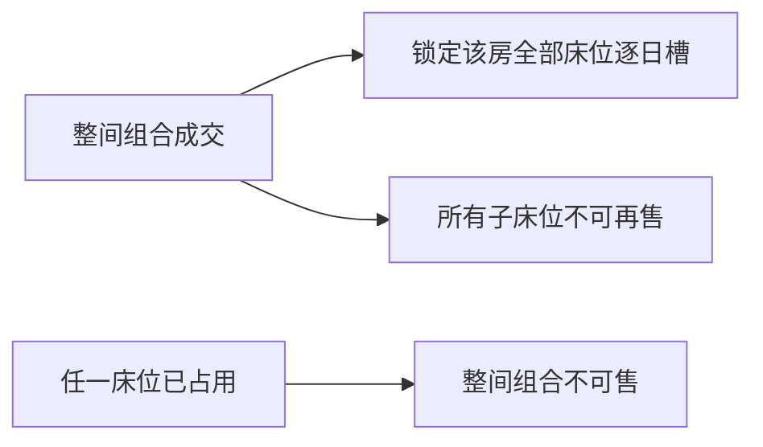

# 秦托邦资产与销售库存目录

> 状态：`CONFIRMED_CATALOG_V3`  
> 业务来源：飞书工作簿 revision `561` 与用户逐房纠错  
> 机器可执行目录：`packages/db/catalog/qintopia-2026-reference-catalog.json`

## 1. 三个不能混用的口径

| 口径 | 数量 | 含义 |
|---|---:|---|
| 实体房间 | 44 | 现场房间资产 |
| 实体床 | 91 | 所有房型的物理床数，不等于可拆售床位数 |
| 独立基础库存 | 77 | 31 个 `ROOM` 单元 + 46 个 `BED` 单元 |
| 多人间整间组合入口 | 13 | 3 个两人间 + 10 个四人间；不是新增库存 |
| 可见销售入口 | 90 | 77 个基础单元 + 13 个组合入口 |

`77` 是可同时独立占用的基础库存闭合数。`90` 只用于统计销售入口或价格产品，不能解释为 90 份可同时出售库存。源表手工常量 `97` 不是床数：它把 3 个两人间的 6 张床再次扩成 12 张，必须拒绝用于容量、库存或经营统计。

## 2. 房型闭合

| 房型 | 售卖单位 | 房间数 | 实体床数 | 独立库存数 |
|---|---|---:|---:|---:|
| 标间（独卫） | `ROOM` | 5 | 10 | 5 |
| 大床房（独卫） | `ROOM` | 2 | 2 | 2 |
| 单人间（独卫） | `ROOM` | 7 | 7 | 7 |
| 套房（独卫） | `ROOM` | 1 | 2 | 1 |
| 标间（公卫） | `ROOM` | 8 | 16 | 8 |
| 单人间（公卫） | `ROOM` | 8 | 8 | 8 |
| 两人间（公卫） | `BED` + 整间组合 | 3 | 6 | 6 |
| 四人间（公卫） | `BED` + 整间组合 | 10 | 40 | 40 |
| **合计** |  | **44** | **91** | **77** |

标间、单人间、大床房、套房均不拆床售卖。只有公卫两人间与公卫四人间产生 `BED` 基础库存，也只有这 13 间多人间提供整间组合入口。

## 3. 逐楼栋物理资产

| 楼栋 | 房间与实体床配置 | 床数 |
|---|---|---:|
| A | A01 标间 2、A02 标间 2、A03 大床 1、A04 大床 1 | 6 |
| B | B01 单人 1、B02 单人 1、B03 标间 2、B04 标间 2 | 6 |
| C | C01-C04 独卫单人间，各 1 | 4 |
| D | D-GEN-01/02 公卫单人间，各 1；D-GEN-03/04/05 公卫标间，各 2 | 8 |
| E | E-GEN-01 独卫标间 2、E-GEN-02 独卫单人 1、E-GEN-03 独卫套房 2 | 5 |
| 1栋 | 101/102/103/105/107/108/109 四人间，各 4；104/106 两人间，各 2 | 32 |
| 2栋 | 201/205 公卫单人间，各 1；202/203/206 四人间，各 4；204 两人间 2 | 16 |
| 3栋 | 301-304 公卫单人间，各 1；305-309 公卫标间，各 2 | 14 |
| **合计** |  | **91** |

### 编码来源

- 当前业务楼栋名为 C 栋；源表 `I01-I04` 只作为来源追溯，运营编码为 `C01-C04`。
- 飞书明细没有 D/E 的稳定房号。`D-GEN-*`、`E-GEN-*` 是 PMS 生成编码，`codeProvenance=PMS_GENERATED`，不得描述成源表原始房号。
- 2 床房物理床号使用 A/B，4 床房使用 A/B/C/D。物理床号不会让仅按间售卖的房型自动变成 `BED` 销售库存。
- 套房的两张实体床均为大床；大床房每间一张大床。

## 4. 多人间互斥模型

公卫两人间和四人间的整间入口是子床位集合上的组合 claim：

- 整间成交必须在 `[arrival, departure)` 的每个服务日锁定该房所有床位。
- 任一子床位在目标日期被订单或维修 claim 占用，整间组合即不可售。
- 不同子床位可以分别成交；整房与子床的冲突必须由同一数据库事务和日槽锁裁决。
- 组合入口没有独立容量，不能通过新增 room claim 绕过子床互斥。

## 5. 目录约束

- 所有类别 `separateElectricityCharge=false`；系统不创建电费价格产品、现金行或附加收费项。
- 目录导入必须闭合 `44/91/31/46/77/13/90`，并逐栋闭合 `6/6/4/8/5/32/16/14`。
- 导入必须保留 revision、源单元格、排除区间、改名和生成编码 provenance。
- `2026价格表!A9:F25` 是底线价格测算版，不得作为对外售价导入。
- D/E 若日后取得现场正式房号，应追加有来源的目录修订；不能把生成编码伪装成历史原始事实。
