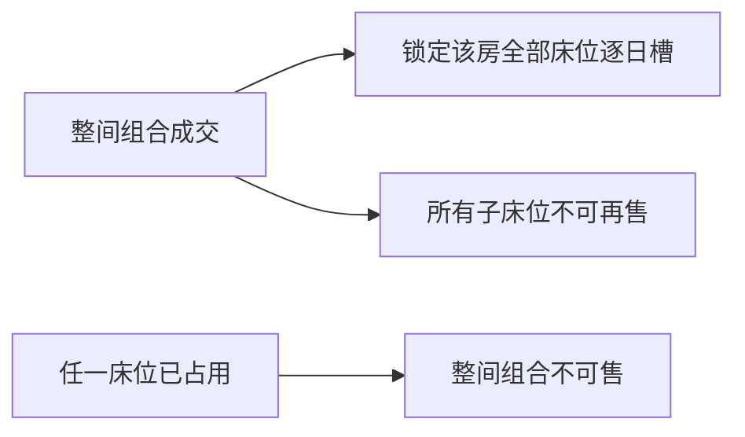

# 秦托邦资产与销售库存目录

> 状态：`CONFIRMED_CATALOG_V3`  
> 业务来源：飞书工作簿 revision `561` 与用户逐房纠错  
> 机器可执行目录：`packages/db/catalog/qintopia-2026-reference-catalog.json`
> `schemaVersion`：`2.0.0`
>
> `importId/catalogVersion`：`qintopia-2026-feishu-revision-561-user-confirmed-v4`
>
> 物业范围：`prop_qintopia_demo` / `QTP-SH`；时区 `Asia/Shanghai`；币种 `CNY`

## 1. 三个不能混用的口径

| 口径 | 数量 | 含义 |
|---|---:|---|
| 实体房间 | 44 | 现场房间资产 |
| 实体床 | 91 | 所有房型的物理床数，不等于可拆售床位数 |
| 独立基础库存 | 77 | 31 个 `ROOM` 单元 + 46 个 `BED` 单元 |
| 多人间整间组合入口 | 13 | 3 个两人间 + 10 个四人间；不是新增库存 |
| 可见销售入口 | 90 | 77 个基础单元 + 13 个组合入口 |

`77` 是可同时独立占用的基础库存闭合数。`90` 只用于统计销售入口或价格产品，不能解释为 90 份可同时出售库存。源表手工常量 `97` 不是床数：它把 3 个两人间的 6 张床再次扩成 12 张，必须拒绝用于容量、库存或经营统计。

## 2. 房型闭合

| 房型 | 售卖单位 | 房间数 | 实体床数 | 独立库存数 |
|---|---|---:|---:|---:|
| 标间（独卫） | `ROOM` | 5 | 10 | 5 |
| 大床房（独卫） | `ROOM` | 2 | 2 | 2 |
| 单人间（独卫） | `ROOM` | 7 | 7 | 7 |
| 套房（独卫） | `ROOM` | 1 | 2 | 1 |
| 标间（公卫） | `ROOM` | 8 | 16 | 8 |
| 单人间（公卫） | `ROOM` | 8 | 8 | 8 |
| 两人间（公卫） | `BED` + 整间组合 | 3 | 6 | 6 |
| 四人间（公卫） | `BED` + 整间组合 | 10 | 40 | 40 |
| **合计** |  | **44** | **91** | **77** |

标间、单人间、大床房、套房均不拆床售卖。只有公卫两人间与公卫四人间产生 `BED` 基础库存，也只有这 13 间多人间提供整间组合入口。

## 3. 逐楼栋物理资产

| 楼栋 | 房间与实体床配置 | 房间数 | 床数 |
|---|---|---:|---:|
| A | A01 标间 2、A02 标间 2、A03 大床 1、A04 大床 1 | 4 | 6 |
| B | B01 单人 1、B02 单人 1、B03 标间 2、B04 标间 2 | 4 | 6 |
| C | C01-C04 独卫单人间，各 1 | 4 | 4 |
| D | D01/02 公卫单人间，各 1；D03/04/05 公卫标间，各 2 | 5 | 8 |
| E | E01 独卫标间 2、E02 独卫单人 1、E03 独卫套房 2 | 3 | 5 |
| 1栋 | 101/102/103/105/107/108/109 四人间，各 4；104/106 两人间，各 2 | 9 | 32 |
| 2栋 | 201/205 公卫单人间，各 1；202/203/206 四人间，各 4；204 两人间 2 | 6 | 16 |
| 3栋 | 301-304 公卫单人间，各 1；305-309 公卫标间，各 2 | 9 | 14 |
| **合计** |  | **44** | **91** |

### 编码来源

- 当前业务楼栋名为 C 栋；源表 `I01-I04` 只作为来源追溯，运营编码为 `C01-C04`。
- 飞书明细没有 D/E 的稳定房号。`D01-D05`、`E01-E03` 是 PMS 生成的运营房号，`codeProvenance=PMS_GENERATED`，不得描述成源表原始房号；内部库存 ID 继续保留最初生成时的稳定值。
- 2 床房物理床号使用 A/B，4 床房使用 A/B/C/D。物理床号不会让仅按间售卖的房型自动变成 `BED` 销售库存。
- 套房的两张实体床均为大床；大床房每间一张大床。当前机器目录只执行套房 `2` 张物理床及 A/B 标签，尚未把“大床”保存成独立 `bedKind` 字段。

## 4. 建筑 → 房间 → 床位运行时目录

稳定 ID 仅在当前 `prop_qintopia_demo/QTP-SH` 物业范围内成立。`ROOM 基础`可独立占用；`ROOM 组合`是全部子床的整间销售入口；`BED 基础`才是可单卖床位。按间房下面列出的物理床没有 `inventory_unit.id`，不会生成 `BED` 库存。

```text
秦托邦
├── A栋（4房 / 6实体床）
│   ├── A01 标间独卫 [ROOM基础: unit_room_a01; private_bath_standard_room]
│   │   └── 物理床 A/B [仅标签，无BED库存]
│   ├── A02 标间独卫 [ROOM基础: unit_room_a02; private_bath_standard_room]
│   │   └── 物理床 A/B [仅标签，无BED库存]
│   ├── A03 大床房独卫 [ROOM基础: unit_room_a03; private_bath_king_room]
│   │   └── 大床 1张 [无BED库存]
│   └── A04 大床房独卫 [ROOM基础: unit_room_a04; private_bath_king_room]
│       └── 大床 1张 [无BED库存]
├── B栋（4房 / 6实体床）
│   ├── B01 单人间独卫 [ROOM基础: unit_room_b01; private_bath_single_room]
│   │   └── 实体床 1张 [无BED库存]
│   ├── B02 单人间独卫 [ROOM基础: unit_room_b02; private_bath_single_room]
│   │   └── 实体床 1张 [无BED库存]
│   ├── B03 标间独卫 [ROOM基础: unit_room_b03; private_bath_standard_room]
│   │   └── 物理床 A/B [仅标签，无BED库存]
│   └── B04 标间独卫 [ROOM基础: unit_room_b04; private_bath_standard_room]
│       └── 物理床 A/B [仅标签，无BED库存]
├── C栋（4房 / 4实体床；源编码 I01-I04）
│   ├── C01 单人间独卫 [ROOM基础: unit_room_c01; private_bath_single_room]
│   │   └── 实体床 1张 [无BED库存]
│   ├── C02 单人间独卫 [ROOM基础: unit_room_c02; private_bath_single_room]
│   │   └── 实体床 1张 [无BED库存]
│   ├── C03 单人间独卫 [ROOM基础: unit_room_c03; private_bath_single_room]
│   │   └── 实体床 1张 [无BED库存]
│   └── C04 单人间独卫 [ROOM基础: unit_room_c04; private_bath_single_room]
│       └── 实体床 1张 [无BED库存]
├── D栋（5房 / 8实体床；源标签“养蜂”）
│   ├── D01 单人间公卫 [ROOM基础: unit_room_d_gen_01; shared_bath_single_room]
│   │   └── 实体床 1张 [无BED库存]
│   ├── D02 单人间公卫 [ROOM基础: unit_room_d_gen_02; shared_bath_single_room]
│   │   └── 实体床 1张 [无BED库存]
│   ├── D03 标间公卫 [ROOM基础: unit_room_d_gen_03; shared_bath_standard_room]
│   │   └── 物理床 A/B [仅标签，无BED库存]
│   ├── D04 标间公卫 [ROOM基础: unit_room_d_gen_04; shared_bath_standard_room]
│   │   └── 物理床 A/B [仅标签，无BED库存]
│   └── D05 标间公卫 [ROOM基础: unit_room_d_gen_05; shared_bath_standard_room]
│       └── 物理床 A/B [仅标签，无BED库存]
├── E栋（3房 / 5实体床；源标签“蝴蝶”）
│   ├── E01 标间独卫 [ROOM基础: unit_room_e_gen_01; private_bath_standard_room]
│   │   └── 物理床 A/B [仅标签，无BED库存]
│   ├── E02 单人间独卫 [ROOM基础: unit_room_e_gen_02; private_bath_single_room]
│   │   └── 实体床 1张 [无BED库存]
│   └── E03 套房独卫 [ROOM基础: unit_room_e_gen_03; private_bath_suite_room]
│       └── 大床 A/B [仅物理标签，无BED库存]
├── 1栋（9房 / 32实体床；32个BED基础 + 9个ROOM组合）
│   ├── 101 四人间公卫 [ROOM组合: unit_room_101; shared_bath_quad_whole_room]
│   │   ├── 101-A [BED基础: unit_room_101_bed_a; shared_bath_quad_bed]
│   │   ├── 101-B [BED基础: unit_room_101_bed_b; shared_bath_quad_bed]
│   │   ├── 101-C [BED基础: unit_room_101_bed_c; shared_bath_quad_bed]
│   │   └── 101-D [BED基础: unit_room_101_bed_d; shared_bath_quad_bed]
│   ├── 102 四人间公卫 [ROOM组合: unit_room_102; shared_bath_quad_whole_room]
│   │   ├── 102-A [BED基础: unit_room_102_bed_a; shared_bath_quad_bed]
│   │   ├── 102-B [BED基础: unit_room_102_bed_b; shared_bath_quad_bed]
│   │   ├── 102-C [BED基础: unit_room_102_bed_c; shared_bath_quad_bed]
│   │   └── 102-D [BED基础: unit_room_102_bed_d; shared_bath_quad_bed]
│   ├── 103 四人间公卫 [ROOM组合: unit_room_103; shared_bath_quad_whole_room]
│   │   ├── 103-A [BED基础: unit_room_103_bed_a; shared_bath_quad_bed]
│   │   ├── 103-B [BED基础: unit_room_103_bed_b; shared_bath_quad_bed]
│   │   ├── 103-C [BED基础: unit_room_103_bed_c; shared_bath_quad_bed]
│   │   └── 103-D [BED基础: unit_room_103_bed_d; shared_bath_quad_bed]
│   ├── 104 两人间公卫 [ROOM组合: unit_room_104; shared_bath_double_whole_room]
│   │   ├── 104-A [BED基础: unit_room_104_bed_a; shared_bath_double_bed]
│   │   └── 104-B [BED基础: unit_room_104_bed_b; shared_bath_double_bed]
│   ├── 105 四人间公卫 [ROOM组合: unit_room_105; shared_bath_quad_whole_room]
│   │   ├── 105-A [BED基础: unit_room_105_bed_a; shared_bath_quad_bed]
│   │   ├── 105-B [BED基础: unit_room_105_bed_b; shared_bath_quad_bed]
│   │   ├── 105-C [BED基础: unit_room_105_bed_c; shared_bath_quad_bed]
│   │   └── 105-D [BED基础: unit_room_105_bed_d; shared_bath_quad_bed]
│   ├── 106 两人间公卫 [ROOM组合: unit_room_106; shared_bath_double_whole_room]
│   │   ├── 106-A [BED基础: unit_room_106_bed_a; shared_bath_double_bed]
│   │   └── 106-B [BED基础: unit_room_106_bed_b; shared_bath_double_bed]
│   ├── 107 四人间公卫 [ROOM组合: unit_room_107; shared_bath_quad_whole_room]
│   │   ├── 107-A [BED基础: unit_room_107_bed_a; shared_bath_quad_bed]
│   │   ├── 107-B [BED基础: unit_room_107_bed_b; shared_bath_quad_bed]
│   │   ├── 107-C [BED基础: unit_room_107_bed_c; shared_bath_quad_bed]
│   │   └── 107-D [BED基础: unit_room_107_bed_d; shared_bath_quad_bed]
│   ├── 108 四人间公卫 [ROOM组合: unit_room_108; shared_bath_quad_whole_room]
│   │   ├── 108-A [BED基础: unit_room_108_bed_a; shared_bath_quad_bed]
│   │   ├── 108-B [BED基础: unit_room_108_bed_b; shared_bath_quad_bed]
│   │   ├── 108-C [BED基础: unit_room_108_bed_c; shared_bath_quad_bed]
│   │   └── 108-D [BED基础: unit_room_108_bed_d; shared_bath_quad_bed]
│   └── 109 四人间公卫 [ROOM组合: unit_room_109; shared_bath_quad_whole_room]
│       ├── 109-A [BED基础: unit_room_109_bed_a; shared_bath_quad_bed]
│       ├── 109-B [BED基础: unit_room_109_bed_b; shared_bath_quad_bed]
│       ├── 109-C [BED基础: unit_room_109_bed_c; shared_bath_quad_bed]
│       └── 109-D [BED基础: unit_room_109_bed_d; shared_bath_quad_bed]
├── 2栋（6房 / 16实体床；14个BED基础 + 4个ROOM组合 + 2个ROOM基础）
│   ├── 201 单人间公卫 [ROOM基础: unit_room_201; shared_bath_single_room]
│   │   └── 实体床 1张 [无BED库存]
│   ├── 202 四人间公卫 [ROOM组合: unit_room_202; shared_bath_quad_whole_room]
│   │   ├── 202-A [BED基础: unit_room_202_bed_a; shared_bath_quad_bed]
│   │   ├── 202-B [BED基础: unit_room_202_bed_b; shared_bath_quad_bed]
│   │   ├── 202-C [BED基础: unit_room_202_bed_c; shared_bath_quad_bed]
│   │   └── 202-D [BED基础: unit_room_202_bed_d; shared_bath_quad_bed]
│   ├── 203 四人间公卫 [ROOM组合: unit_room_203; shared_bath_quad_whole_room]
│   │   ├── 203-A [BED基础: unit_room_203_bed_a; shared_bath_quad_bed]
│   │   ├── 203-B [BED基础: unit_room_203_bed_b; shared_bath_quad_bed]
│   │   ├── 203-C [BED基础: unit_room_203_bed_c; shared_bath_quad_bed]
│   │   └── 203-D [BED基础: unit_room_203_bed_d; shared_bath_quad_bed]
│   ├── 204 两人间公卫 [ROOM组合: unit_room_204; shared_bath_double_whole_room]
│   │   ├── 204-A [BED基础: unit_room_204_bed_a; shared_bath_double_bed]
│   │   └── 204-B [BED基础: unit_room_204_bed_b; shared_bath_double_bed]
│   ├── 205 单人间公卫 [ROOM基础: unit_room_205; shared_bath_single_room]
│   │   └── 实体床 1张 [无BED库存]
│   └── 206 四人间公卫 [ROOM组合: unit_room_206; shared_bath_quad_whole_room]
│       ├── 206-A [BED基础: unit_room_206_bed_a; shared_bath_quad_bed]
│       ├── 206-B [BED基础: unit_room_206_bed_b; shared_bath_quad_bed]
│       ├── 206-C [BED基础: unit_room_206_bed_c; shared_bath_quad_bed]
│       └── 206-D [BED基础: unit_room_206_bed_d; shared_bath_quad_bed]
└── 3栋（9房 / 14实体床）
    ├── 301 单人间公卫 [ROOM基础: unit_room_301; shared_bath_single_room]
    │   └── 实体床 1张 [无BED库存]
    ├── 302 单人间公卫 [ROOM基础: unit_room_302; shared_bath_single_room]
    │   └── 实体床 1张 [无BED库存]
    ├── 303 单人间公卫 [ROOM基础: unit_room_303; shared_bath_single_room]
    │   └── 实体床 1张 [无BED库存]
    ├── 304 单人间公卫 [ROOM基础: unit_room_304; shared_bath_single_room]
    │   └── 实体床 1张 [无BED库存]
    ├── 305 标间公卫 [ROOM基础: unit_room_305; shared_bath_standard_room]
    │   └── 物理床 A/B [仅标签，无BED库存]
    ├── 306 标间公卫 [ROOM基础: unit_room_306; shared_bath_standard_room]
    │   └── 物理床 A/B [仅标签，无BED库存]
    ├── 307 标间公卫 [ROOM基础: unit_room_307; shared_bath_standard_room]
    │   └── 物理床 A/B [仅标签，无BED库存]
    ├── 308 标间公卫 [ROOM基础: unit_room_308; shared_bath_standard_room]
    │   └── 物理床 A/B [仅标签，无BED库存]
    └── 309 标间公卫 [ROOM基础: unit_room_309; shared_bath_standard_room]
        └── 物理床 A/B [仅标签，无BED库存]
```

数据库投影必须闭合为 `44 ROOM = 31 ROOM基础 + 13 ROOM组合`，以及 `46 BED基础 = 1栋32 + 2栋14`。因此表中共有 90 个可见销售入口，但只有 77 个可同时独立占用的基础库存。

## 5. 多人间互斥模型

公卫两人间和四人间的整间入口是子床位集合上的组合 claim：



- 整间成交必须在 `[arrival, departure)` 的每个服务日锁定该房所有床位。
- 任一子床位在目标日期被订单或维修 claim 占用，整间组合即不可售。
- 不同子床位可以分别成交；整房与子床的冲突必须由同一数据库事务和日槽锁裁决。
- 组合入口没有独立容量，不能通过新增 room claim 绕过子床互斥。

## 6. 目录约束

- 所有类别 `separateElectricityCharge=false`；系统不创建电费价格产品、现金行或附加收费项。
- 目录导入必须闭合 `44/91/31/46/77/13/90`，并逐栋闭合 `6/6/4/8/5/32/16/14`。
- 导入必须保留 revision、源单元格、排除区间、改名和生成编码 provenance。
- `2026价格表!A9:F25` 是底线价格测算版，不得作为对外售价导入。
- D/E 若日后取得现场正式房号，应追加有来源的目录修订；不能把生成编码伪装成历史原始事实。
